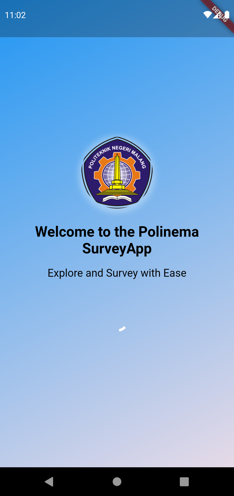

# SurveyKomplainMahasiswaApp-PemrogramanMobile

## Latar Belakang
Proyek ini bertujuan untuk membuat aplikasi mobile yang dapat menampilkan hasil survey komplain mahasiswa tentang kampus.

## Manfaat Sistem
   * Memudahkan pihak perguruan tinggi dalam memonitor dan mengevaluasi layanan komplain maupun pengaduan
   * Tampilan dashboard mempercepat pihak perguruan tinggi dalam memahami informasi dan trennya
   * Mengakomodasi mahasiswa dalam menyampaikan pengaduan atau keluhannya ke pihak perguruan tinggi
   * Menjadi salah satu media komunikasi yang baik antara mahasiswa dengan pihak perguruan tinggi sehingga dapat menyelesaikan masalah dengan lebih efektif
   * Meningkatkan kepuasan dan loyalitas mahasiswa terhadap perguruan tinggi

## Diagram Alur (Flowchart)

Flowchart di atas adalah representasi visual dari proses atau alur kerja aplikasi mobile untuk melihat hasil survey. Berikut adalah penjelasannya:

- Mulai dari titik "Start" di bagian atas.
- Langkah pertama yaitu "Melihat halaman utama". Halaman ini adalah halaman yang pertama tampil setelah pengguna berhasil membuka aplikasi. Di halaman ini pengguna bisa meelihat dashboard yang berisi beberapa informasi meliputi Total Surveys, Sum of Problem Factors, Sum of Respondents Based on Gender, Sum of Respondents Based on Country of Origin, Average of Age, dan Average of GPA. 
- Setelah itu terdapat simbol decision "lihat detail total survey?". Ini melibatkan keputusan pengguna apakah ingin melihat detail survei atau tidak.
- Jika "Ya", pengguna akan diteruskan ke langkah selanjutnya yaitu bisa melihat halaman detail hasil survey. Namun, jika pengguna memilih "Tidak" maka pengguna bisa melihat ke informasi lain misalnya Sum of Problem Factors. Di langkah ini akan ada simbol decision lagi "Pilih faktor?" untuk memilih kategori faktor yang ingin dilihat.
- Jika "Ya", pengguna akan bisa melihat jumlah masalah dari faktor yang sudah dipilih. Tetapi, jika "Tidak" pengguna bisa melihat ke informasi lain misalnya Sum of Respondents Based on Gender. Di langkah ini akan ada simbol decision lagi "Pilih gender?" untuk memilih kategori gender yang ingin dilihat datanya.
- Jika "Ya", pengguna akan bisa melihat jumlah responden dari kategori gender yang sudah dipilih. Namun, jika "Tidak" pengguna bisa melihat ke informasi lain misalnya Sum of Respondents Based on Country of Origin. Di langkah ini akan ada simbol decision lagi "Pilih negara?" untuk memilih kategori negara yang ingin dilihat datanya.
- Jika pengguna memilih "Ya", pengguna akan bisa ngelihat jumlah responden dari kategori negara yang sudah dipilih. Tetapi, jika "Tidak" alur akan berakhir di titik "End".

Flowchart tersebut dapat membantu pengguna untuk memahami alur dari aplikasi mobile dalam memonitor hasil survey komplain mahasiswa.

## Dokumentasi
#### 1. Login (Autentikasi)

Fitur ini digunakan oleh pengguna agar bisa mengakases aplikasi. Pengguna harus memasukkan username dan password yang terdaftar pada database sistem. Jika password yang dimasukkan tidak valid maka akan muncul notifikasi Invalid Password.

#### 2. Splash Page

Splash Page ini merupakan halaman pertama yang muncul ketika pengguna berhasil mengakses aplikasi surveykomplainapp. Halaman tersebut akan menampilkan logo instansi perguruan tinggi sebagai identitas dan pengenalan. Halaman ini berfungsi untuk meberikan kesan pertama yang menarik kepada pengguna, serta memberikan waktu bagi aplikasi untuk memuat data atau proses yang diperlukan sebelum masuk ke halaman utama. Splash Page ini ditampilkan beberapa detik sebelum berpindah ke halaman Opsi Menu.

#### 3. Opsi Menu

Pada halaman ini pengguna dapat memilih menu yang ingin diakses dalam menggunakan aplikasi. Terdapat tiga opsi menu yaitu Dashboard, List Report, dan Penganduan Kekerasan Seksual.

#### 4. Dashboard

Halaman dashboard pada surveykomplainapp merupakan halaman yang menampilkan informasi penting terkait survey atau komplain yang telah diisi oleh mahasiswa. Halaman ini berfungsi untuk memberikan gambaran umum kepada pengguna mengenai hasil survey dan informasi lainnya mengenai data komplain.

#### 5. Complain Form

Form komplain tersebut memungkinkan mahasiswa untuk menyampaikan keluhan atau saran terhadap layanan yang diberikan oleh oleh perguruan tinggi. Mahasiswa dapat memilihi jenis keluhan, laporan keluhannya, dan data diri seperti umur, IPK, tahun, gender, serta kewarganegaraan.

#### 6. Detail Survey

Halaman ini memudahkan pengguna untuk melihat secara detail semua data survey. Di halaman ini menampilkan genre dan reports yang diberikan mahasiswa.

#### 7. List Reports

Menu ini menampilkan data pengaduan kekerasan seksual yang diperoleh dari inputan menu pengaduan kekerasan seksual. Pada menu ini akan jenis laporan, kronologi, dan gambar sebagai bukti.

#### 8. Pengaduan Kekerasan Seksual

Menu pengaduan kekerasan seksual pada surveykomplainapp adalah sebuah fitur yang memungkinkan mahasiswa untuk melaporkan kasus-kasus kekerasan seksual yang dialami atau disaksikan di lingkungan kampus.

Pop up tersebut akan tampil jika pengguna tidak memiliki akses ke menu pengaduan kekerasan seksual karena statusnya tidak lulus.

Jika pengguna memiliki akses terhadap menu ini maka bisa melaporkan aduannya ke pihak perguruan tinggi dengan mengisi form tersebut.  

## Kontributor

| Foto | Nama Lengkap | GitHub | Peran |
|:----:|:------------:|:------:|:-----:|
|  | Muhamad Helmi Permana Agung | [N00budrag0n](https://github.com/N00budrag0n) | Backend Flutter dan Frontend Flutter |
|  | Ibnu Tsalis Assalam | [i9191](https://github.com/i9191) | Backend Laravel dan Backend Flutter |
|  | Khosyi Nasywa Imanda | [KhosyiNasywaImanda](https://github.com/KhosyiNasywaImanda) | Design UI dan Frontend Flutter |
|  | Nafiatul Fadlilah | [NafiatulFadlilah](https://github.com/NafiatulFadlilah) | Design Alur Sistem dan Frontend Flutter |

