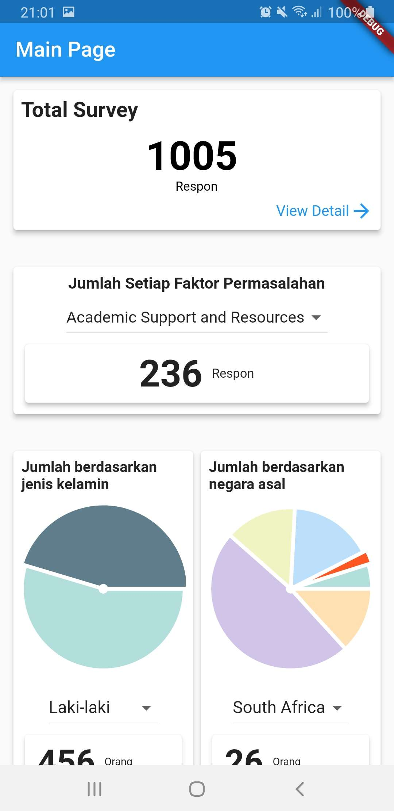
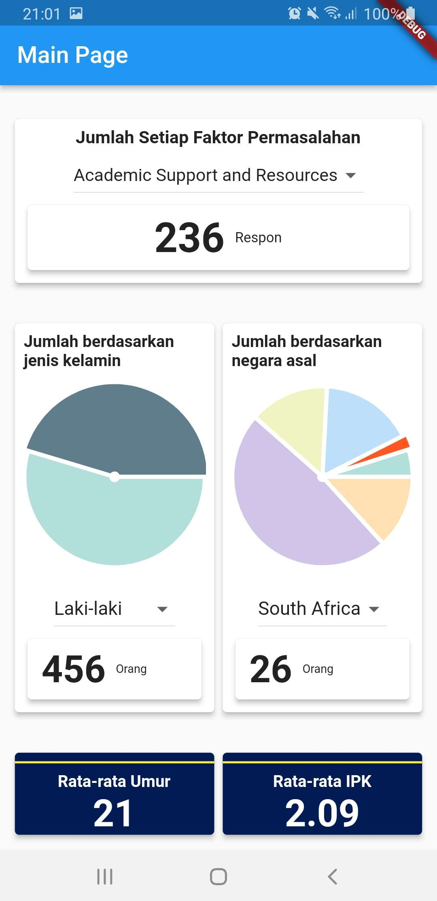

# SurveyKomplainMahasiswaApp-PemrogramanMobile

## Latar Belakang
Proyek ini bertujuan untuk membuat aplikasi mobile yang dapat menampilkan hasil survey komplain mahasiswa tentang kampus.

## Diagram Alur (Flowchart)

Flowchart di atas adalah representasi visual dari proses atau alur kerja aplikasi mobile untuk melihat hasil survey. Berikut adalah penjelasannya:

- Mulai dari titik "Start" di bagian atas.
- Langkah pertama yaitu "Melihat halaman utama". Halaman ini adalah halaman yang pertama tampil setelah pengguna berhasil ngebuka aplikasi. Di halaman ini pengguna bisa ngelihat dashboard yang berisi beberapa informasi di antaranya ada Total Surveys, Sum of Problem Factors, Sum of Respondents Based on Gender, Sum of Respondents Based on Country of Origin, Average of Age, dan Average of GPA. 
- Setelah itu ada simbol decision "lihat detail total survey?". Ini melibatkan keputusan pengguna apakah ingin ngelihat detail survei atau tidak.
- Kalau "Ya", pengguna akan diteruskan ke langkah selanjutnya yaitu bisa ngelihat halaman detail hasil survey. Kalau pengguna memilih "Tidak" maka pengguna bisa melihat ke informasi lain misalnya Sum of Problem Factors. Di langkah ini akan ada simbol decision lagi "Pilih faktor?" buat memilih kategori faktor yang ingin dilihat.
- Kalau "Ya", pengguna bakal bisa ngelihat jumlah masalah dari faktor yang sudah dipilih. Kalau "Tidak" pengguna bisa melihat ke informasi lain misalnya Sum of Respondents Based on Gender. Di langkah ini akan ada simbol decision lagi "Pilih gender?" buat memilih kategori gender yang ingin dilihat datanya.
- Kalau "Ya", pengguna bakal bisa ngelihat jumlah responden dari kategori gender yang sudah dipilih. Kalau "Tidak" pengguna bisa melihat ke informasi lain misalnya Sum of Respondents Based on Country of Origin. Di langkah ini akan ada simbol decision lagi "Pilih negara?" buat memilih kategori negara yang ingin dilihat datanya.
- Kalau pengguna memilih "Ya", pengguna bakal bisa ngelihat jumlah responden dari kategori negara yang sudah dipilih. Kalau "Tidak" alur akan berakhir di titik "End".

Flowchart tadi bisa ngebantu pengguna buat memahami alur dari aplikasi mobile untuk melihat hasil survey komplain mahasiswa.

## Dokumentasi
#### 1. Homepage (Halaman Utama)

Gambar di atas merupakan homepage dari aplikasi mobile untuk melihat hasil survey. Di halaman ini pengguna bisa melihat dashboard yang berisi beberapa informasi di antaranya ada Total Surveys, Sum of Problem Factors, Sum of Respondents Based on Gender, Sum of Respondents Based on Country of Origin, Average of Age, dan Average of GPA.

#### 2. Detail Page (Survey List)

Gambar di atas merupakan detailpage dari aplikasi mobile untuk melihat semua data survey. Di halaman ini pengguna bisa melihat survey yang berisi genre dan reports yang diberikan responden.

 

## Kontributor

| Foto | Nama Lengkap | GitHub | Peran |
|:----:|:------------:|:------:|:-----:|
|  | Muhamad Helmi Permana Agung | [N00budrag0n](https://github.com/N00budrag0n) | Backend Flutter dan Frontend Flutter |
|  | Ibnu Tsalis Assalam | [i9191](https://github.com/i9191) | Backend Laravel dan Backend Flutter |
|  | Khosyi Nasywa Imanda | [KhosyiNasywaImanda](https://github.com/KhosyiNasywaImanda) | Design UI dan Frontend Flutter |
|  | Nafiatul Fadlilah | [NafiatulFadlilah](https://github.com/NafiatulFadlilah) | Design Alur Sistem dan Frontend Flutter |

